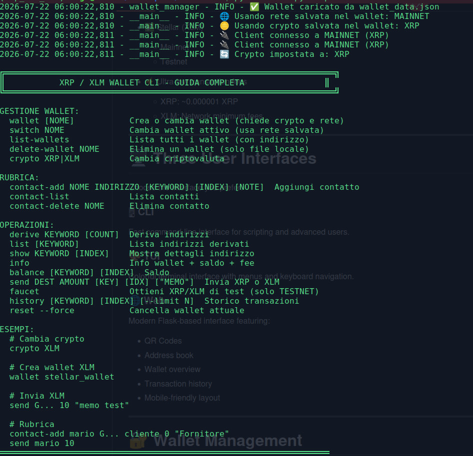
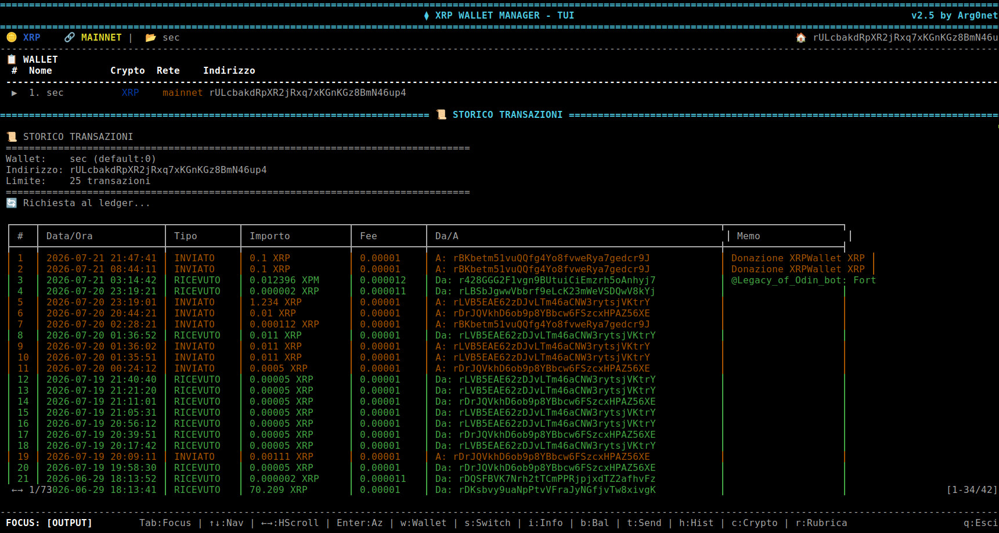
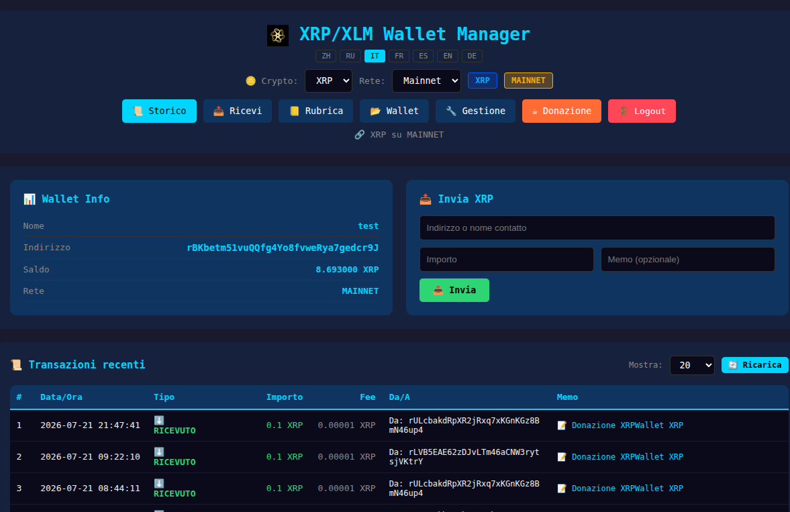
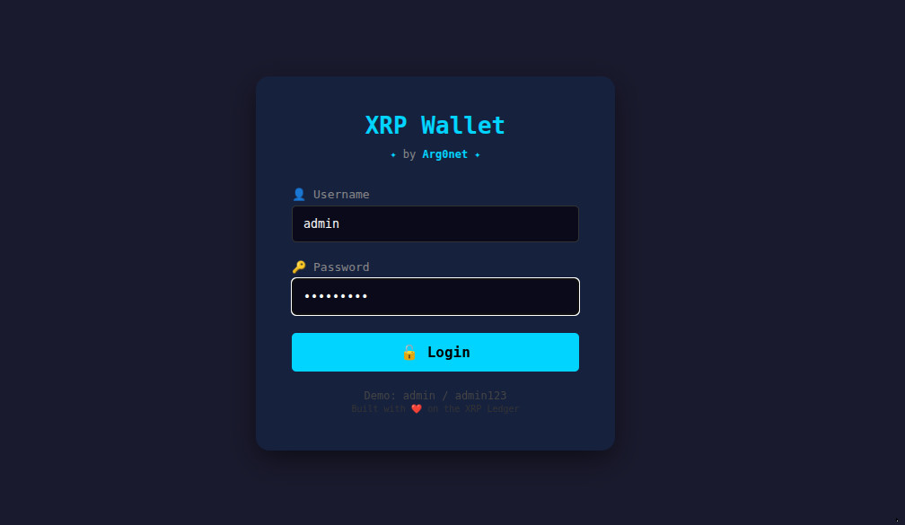
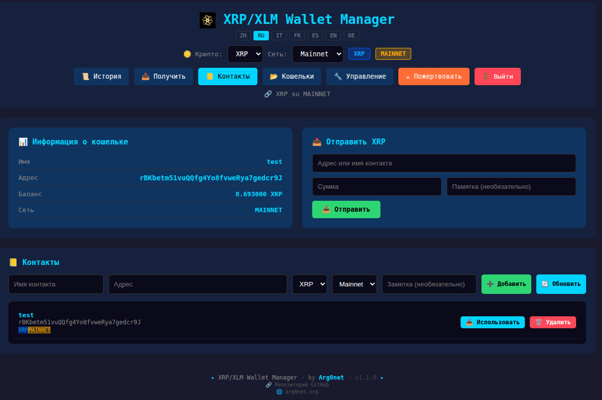
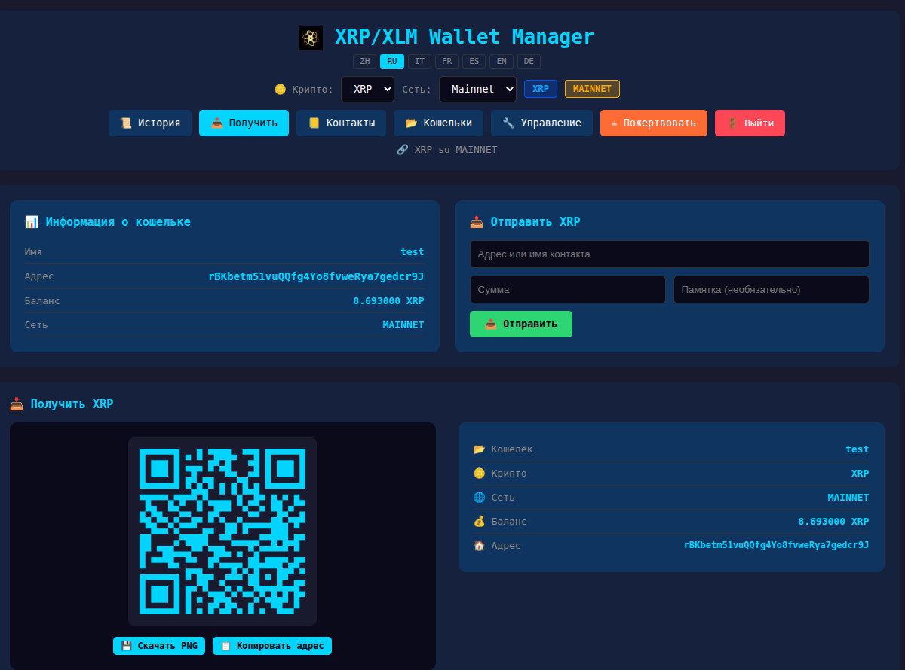

# 💰 XRPWallet - XRP/XLM Wallet Manager

> A lightweight, multi-wallet manager for **XRP Ledger (XRPL)** and **Stellar (XLM)** featuring **CLI**, **Terminal UI**, and **Web Interface**.


---

<p align="center">
  
</p>

---

# 🚀 Features

## 💎 Multi-Currency Support

- ✅ XRP Ledger (XRPL)
  - Mainnet
  - Testnet
  - Devnet

- ✅ Stellar (XLM)
  - Mainnet
  - Testnet

- ⚡ Ultra-low transaction fees
  - XRP: ~0.000001 XRP
  - XLM: Network minimum fees

---

# 🖥️ Three User Interfaces

Choose the interface you prefer.

### 🖥 CLI

Fast command-line interface for scripting and advanced users.

### 🎨 TUI

Colorful terminal interface with menus and keyboard navigation.

### 🌐 Web

Modern Flask-based interface featuring:

- QR Codes
- Address book
- Wallet overview
- Transaction history
- Mobile-friendly layout

---

# 🔐 Wallet Management

Manage as many wallets as you like.

Supported wallet types:

- ✅ BIP39 Mnemonic (12 words)
- ✅ BIP39 Mnemonic (24 words)
- ✅ XRP Family Seed (`s...`)
- ✅ Stellar Secret Key (`S...`)
- ✅ Xaman numeric backup
- ✅ Raw Private Keys (HEX)

Features:

- Multi-wallet management
- Import existing wallets
- Create new wallets
- Rename wallets
- Delete wallets
- Active wallet selection
- Automatic address derivation

---

# 💸 Transactions

### XRP

- Send XRP
- Receive XRP
- Network fee display
- Real-time balance
- Transaction history

### Stellar

- Send XLM
- Receive XLM
- Memo support
- Balance
- Transaction history

---

# 🪙 XRP Issued Tokens

Support for XRPL issued assets.

Examples:

- USD
- EUR
- RLUSD
- XPM
- Custom Tokens

Features:

- Automatic token detection
- Trust Line support
- Token balances
- Token transfers

---

# 📒 Address Book

Built-in contact manager.

- Add contacts
- Edit contacts
- Delete contacts
- Search contacts
- Human-readable names
- Network identification
- Cryptocurrency identification

Example:

| Name | Network | Address |
|------|---------|----------|
| Alice | XRP | r... |
| Bob | XLM | G... |

---

# 📱 Extra Features

- ✅ QR Code generation
- ✅ Copy address to clipboard
- ✅ Integrated blockchain explorers
- ✅ XRP Testnet Faucet
- ✅ Stellar Testnet Friendbot
- ✅ Automatic network recognition
- ✅ Automatic address validation

---

# 🌍 Supported Explorers

### XRP

- XRPScan

### Stellar

- Stellar Expert

Open any wallet or transaction directly from the application.

---

# 📸 Screenshots

## CLI

<p align="center">
  
</p>

---

## TUI

<p align="center">
  
</p>

---

## Web Interface

<p align="center">
  
</p>

---


# 📦 Installation

```bash
git clone https://github.com/argo79/XRPwallet.git

cd XRPwallet

pip install -r requirements.txt
```

---

# ▶️ Run

CLI

```bash
python cli.py
```

Terminal UI

```bash
python tui.py
```

Web Interface

```bash
python web.py
```

---

# 📁 Project Structure

```
XRPwallet/
│
├── cli.py
├── tui.py
├── web.py
├── wallet_manager.py
├── wallets/
├── screenshots/
├── requirements.txt
└── README.md
```

---

# 🎯 Roadmap

- [ ] XRP Trust Lines
- [ ] RLUSD support
- [ ] Token issuer creation
- [ ] DEX trading
- [ ] Escrow transactions
- [ ] Payment Channels
- [ ] Multisignature wallets
- [ ] Hardware wallet support
- [ ] Monero (XMR)
- [ ] Bitcoin (BTC)
- [ ] Ethereum (ETH)
- [ ] Solana (SOL)

---

# 🤝 Contributing

Contributions, issues and feature requests are welcome.

Feel free to open a Pull Request.

---

# 📄 License

Released under the **MIT License**.

---

# ⭐ Support

If you like this project, consider giving it a **⭐ Star** on GitHub.

# 📦 Installazione

## Via pip *(consigliato per sviluppatori)*

```bash
pip install xrpwallet
```

---

## 🐧 Linux - Eseguibile Standalone

```bash
wget https://github.com/argo79/XRPwallet/releases/download/v1.0.0/xrpwallet-linux

chmod +x xrpwallet-linux

./xrpwallet-linux
```

---

## 🪟 Windows - Eseguibile

Scarica **`xrpwallet-windows.exe`** dalla pagina delle **Releases** e avvialo.

---

## 🍎 macOS - Eseguibile

```bash
chmod +x xrpwallet-mac

./xrpwallet-mac
```

---

## 🐳 Docker

```bash
docker run -it -p 5000:5000 argo79/xrpwallet
```

---

# 🚀 Guida Rapida

## 🆕 Creare un nuovo Wallet

```bash
./xrpwallet
```

Successivamente:

1. Seleziona **Crea nuovo wallet**
2. Inserisci un nome (es. `personale`)
3. Scegli la criptovaluta (**XRP** oppure **XLM**)
4. Scegli la rete (**Mainnet**, **Testnet** o **Devnet**)
5. Seleziona **Crea nuovo (genera 24 parole BIP39)**
6. Inserisci una passphrase *(opzionale)*

---

## 📥 Importare un Wallet Esistente

```bash
./xrpwallet
```

Scegli **Importa da Seed** e inserisci uno dei formati supportati:

* ✅ Seed BIP39 (12 parole)
* ✅ Seed BIP39 (24 parole)
* ✅ Seed XRP (`s...`)
* ✅ Seed Stellar (`S...`)
* ✅ Numeri Xaman (8 gruppi da 6 cifre)
* ✅ Private Key (64 caratteri esadecimali)

---

# 📚 Guida Dettagliata

# 1️⃣ Creazione Wallet

## 🆕 Creazione da Zero (BIP39 - 24 parole)

```bash
./xrpwallet wallet personale
```

### Procedura

1. Scegli la criptovaluta (**XRP** o **XLM**)
2. Scegli la rete (**Mainnet**, **Testnet** o **Devnet**)
3. Seleziona **Crea nuovo (24 parole BIP39)**
4. Inserisci una passphrase *(opzionale)*
5. Conserva con cura le 24 parole generate.

> ⚠️ **IMPORTANTE**
>
> Le 24 parole sono l'unico metodo per recuperare il wallet.
> Conservale offline e in un luogo sicuro.

---

## 🔢 Importare un Wallet Xaman (Secret Numbers)

Xaman (ex XUMM) utilizza **8 gruppi di 6 cifre**.

```bash
./xrpwallet wallet xaman
```

Esempio:

```text
A:123456
B:234567
C:345678
D:456789
E:567890
F:678901
G:789012
H:890123
```

### Formati supportati

Con lettere:

```text
A:123456 B:234567 C:345678 D:456789 E:567890 F:678901 G:789012 H:890123
```

Solo numeri:

```text
123456 234567 345678 456789 567890 678901 789012 890123
```

Sono accettati sia i prefissi **A-H** sia la sola sequenza numerica.

---

## 📝 Importare un Seed BIP39

```bash
./xrpwallet wallet mywallet
```

Inserisci:

* 12 parole
* oppure 24 parole

separate da spazio.

Se il wallet utilizza una **passphrase BIP39**, inseriscila quando richiesta.

---

## 🔑 Importare un Seed XRP

```bash
./xrpwallet wallet mywallet
```

Inserisci un seed XRP nel formato:

```text
sEdTVyS93eSa1P4GcWjMq4V
```

---

## 🌟 Importare un Seed Stellar

```bash
./xrpwallet wallet mywallet
```

Inserisci un secret Stellar:

```text
SDV3WVDKMYCGQLMVZBG6ONQGXVSQYPPFDVQZKSR4NN33PUKAOBYZQN6O
```

---

## 🔐 Importare una Private Key

```bash
./xrpwallet wallet mywallet
```

Inserisci una private key esadecimale da **64 caratteri**.

Esempio:

```text
2d2bb3b3ae2012af879dfde7a8190d465f50beb56a207ca37e8871c91a8150b4
```

---

# 2️⃣ Gestione Wallet

## 📂 Cambiare Wallet Attivo

```bash
./xrpwallet switch personale
```

### TUI

* ↑ ↓ per navigare
* **Invio** per selezionare

### Web GUI

Seleziona il wallet direttamente dalla lista.

---

## 📋 Elenco Wallet Salvati

```bash
./xrpwallet list-wallets
```

Output di esempio:

```text
📂 WALLET SALVATI

#   Nome          Crypto   Rete      Indirizzo

▶ 1. personale    XRP      Mainnet   r...
  2. xaman        XRP      Mainnet   r...
  3. stellar      XLM      Testnet   G...
```

---

## 🗑️ Eliminare un Wallet

```bash
./xrpwallet delete-wallet personale --force
```

# 3️⃣ Transactions

## 💸 Send XRP

```bash
# Send to an XRP address
./xrpwallet send rLVB5EAE62zDJvLTm46aCNW3rytsjVKtrY 10

# Send to a contact from the address book
./xrpwallet send mario 10

# Send with a memo
./xrpwallet send rLVB5EAE62zDJvLTm46aCNW3rytsjVKtrY 10 "payment invoice"

# Send using a specific wallet
./xrpwallet send rLVB5EAE62zDJvLTm46aCNW3rytsjVKtrY 10 personale 0
```

---

## 🌟 Send XLM

```bash
# Send to a Stellar address
./xrpwallet send GDB7BLZWZTXYB6C2BHTHAIYVVRPMAGKD2NA35KNGD4MSMW76IQYOUOLZ 10

# Send with Memo ID
./xrpwallet send GDB7BLZWZTXYB6C2BHTHAIYVVRPMAGKD2NA35KNGD4MSMW76IQYOUOLZ 10 --memo-id 12345
```

---

## 💰 Network Fees

| Network     |    Base Fee | Typical Transaction Fee |
| ----------- | ----------: | ----------------------: |
| XRP Mainnet |    10 drops |        **0.000001 XRP** |
| XRP Testnet |    10 drops |        **0.000001 XRP** |
| XLM Mainnet | 100 stroops |         **0.00001 XLM** |
| XLM Testnet | 100 stroops |         **0.00001 XLM** |

> 💡 **Note**
>
> XRP transaction fees are among the lowest of any major blockchain, typically around **0.000001 XRP**.

---

## 📜 Transaction History

```bash
# History of the active wallet
./xrpwallet history

# History of a specific address
./xrpwallet history rLVB5EAE62zDJvLTm46aCNW3rytsjVKtrY

# Show only the latest 20 transactions
./xrpwallet history --limit 20
```

Example output:

```text
┌────┬─────────────────────┬────────────┬──────────────────┬────────────┬────────────────────────────────────────────┐
│ #  │ Date & Time         │ Type       │ Amount           │ Fee        │ From / To                                  │
├────┼─────────────────────┼────────────┼──────────────────┼────────────┼────────────────────────────────────────────┤
│ 1  │ 2026-07-21 14:23:57 │ RECEIVED   │ 10.000000 XRP    │ 0.000001   │ From: rLVB5EAE62zDJvLTm46aCNW3rytsjVKtrY    │
│ 2  │ 2026-07-21 10:15:32 │ SENT       │ 5.000000 XRP     │ 0.000001   │ To:   rBKbetm51vuQQfg4Yo8fvweRya7gedcr9J    │
└────┴─────────────────────┴────────────┴──────────────────┴────────────┴────────────────────────────────────────────┘
```

---

<p align="center">
  
</p>


---

# 4️⃣ Networks

## 🌐 Mainnet (Production)

```bash
./xrpwallet --network mainnet
```

> ⚠️ **Warning**
>
> Mainnet uses **real XRP/XLM**. Transactions are irreversible.

---

## 🧪 Testnet

```bash
./xrpwallet --network testnet

./xrpwallet faucet
```

The Testnet provides free test coins for development and experimentation without risking real funds.

---

## 🛠️ Devnet

```bash
./xrpwallet --network devnet
```

Devnet is intended for developers testing experimental XRPL features.

---

# 5️⃣ User Interfaces

## 🖥️ Command Line Interface (CLI)

```bash
./xrpwallet

./xrpwallet wallet MEW

./xrpwallet balance
```

---

## 🎨 Terminal User Interface (TUI)

```bash
./xrpwallet --tui
```

### Keyboard Shortcuts

| Key   | Action                |
| ----- | --------------------- |
| ↑ / ↓ | Navigate wallets      |
| Enter | Select wallet         |
| **i** | Wallet information    |
| **b** | Show balance          |
| **h** | Transaction history   |
| **t** | Send transaction      |
| **r** | Address book          |
| **w** | Wallet management     |
| **c** | Switch cryptocurrency |
| **q** | Quit                  |

---

## 🌐 Web Interface

```bash
./xrpwallet --gui

./xrpwallet --gui --port 8080

./xrpwallet --gui --host 0.0.0.0
```

### Default Login

```text
Username: admin
Password: admin123
```

<p align="center">
  
</p>


> ⚠️ **Security Notice**
>
> Change the default administrator password after your first login.


---

# 6️⃣ Address Book

## ➕ Add a Contact

```bash
./xrpwallet contact-add mario rLVB5EAE62zDJvLTm46aCNW3rytsjVKtrY

./xrpwallet contact-add mario rLVB5EAE62zDJvLTm46aCNW3rytsjVKtrY "Supplier"

./xrpwallet contact-add mario rLVB5EAE62zDJvLTm46aCNW3rytsjVKtrY cliente 0 "XRP Mainnet"
```

<p align="center">
  
</p>

---

## 📋 List Contacts

```bash
./xrpwallet contact-list
```

Example output:

```text
📒 ADDRESS BOOK

Name            Address                                      Crypto  Network   Notes
------------------------------------------------------------------------------------------
mario           rLVB5EAE62zDJvLTm46aCNW3rytsjVKtrY            XRP     Mainnet   Supplier
```

---

## 🗑️ Delete a Contact

```bash
./xrpwallet contact-delete mario
```

---

# 7️⃣ Receive Payments with QR Codes

The Web Interface automatically generates a QR Code for every wallet.

Navigate to:

> **Receive**

Available features:

* ✅ Automatic QR Code generation
* ✅ Copy address to clipboard
* ✅ Download QR Code as PNG
* ✅ Direct blockchain explorer link
* ✅ Display wallet balance
* ✅ Display current network


<p align="center">
  
</p>

---

# 8️⃣ Integrated Blockchain Explorers

| Network | XRP                   | Stellar                  |
| ------- | --------------------- | ------------------------ |
| Mainnet | XRPScan               | Stellar Expert           |
| Testnet | XRPL Testnet Explorer | Stellar Testnet Explorer |

Explorer links are automatically available from:

* Transaction History
* Wallet Details
* Receive Page

---

# 📁 Data Directory

All wallet data is stored locally.

```text
~/.xrpwallet/
│
├── wallets/
│   ├── personale.json
│   ├── xaman.json
│   └── stellar.json
│
├── wallet_data.json
├── rubrica.json
├── active_wallet.txt
└── web_config.json
```

| File                | Description                 |
| ------------------- | --------------------------- |
| `wallets/`          | Saved wallets               |
| `wallet_data.json`  | Current wallet information  |
| `rubrica.json`      | Address book                |
| `active_wallet.txt` | Active wallet               |
| `web_config.json`   | Web interface configuration |

---

# 🔧 Development

## Clone the Repository

```bash
git clone https://github.com/argo79/XRPwallet.git

cd XRPwallet
```

---

## Install in Development Mode

```bash
pip install -e .
```

---

## Build Standalone Executables

```bash
./prepare_build.sh

./build_xrpwallet_linux.sh

./build_all.sh
```

---

## Run Tests

```bash
xrpwallet --version

xrpwallet --tui

xrpwallet --gui --port 5000
```

---

# 📦 Dependencies

## Python

* `xrpl-py` — XRP Ledger support
* `stellar-sdk` — Stellar Network support
* `flask` — Web interface
* `qrcode` — QR Code generation
* `mnemonic` — BIP39 mnemonic phrases
* `bip32` — HD wallet derivation
* `cryptography` — Cryptographic primitives
* `ecdsa` — Digital signatures
* `base58` — Base58 encoding

---

## Node.js

Used only for Xaman Secret Numbers support.

* `xrpl-secret-numbers`

---

# 🗺️ Roadmap

## ✅ Completed

* Multi-wallet support
* XRP support
* Stellar (XLM) support
* Command Line Interface (CLI)
* Terminal User Interface (TUI)
* Web Interface
* Address Book
* QR Code generation
* Transaction History
* Ultra-low transaction fees
* Xaman Secret Numbers
* Mainnet / Testnet / Devnet support

---

## 🚧 In Progress

* Multi-signature wallets
* Encrypted backups
* CSV tax reports
* Built-in exchange
* Push notifications

---

## 🔮 Planned Features

* Flutter / React Native mobile app
* Hardware wallet integration
* DeFi support
* NFT viewer
* Additional blockchain support

---

# 🤝 Contributing

Contributions are welcome!

1. Fork the repository
2. Create a feature branch

```bash
git checkout -b feature/my-feature
```

3. Commit your changes

```bash
git commit -m "Add awesome feature"
```

4. Push your branch

```bash
git push origin feature/my-feature
```

5. Open a Pull Request

---

# 📄 License

Released under the **MIT License**.

Copyright © 2024–2026 **Arg0net**

---

# 🙏 Credits

* **Author:** Arg0net
* **XRP Ledger:** XRPL Foundation
* **Stellar:** Stellar Development Foundation

Inspired by:

* Xaman Wallet
* XRP Toolkit

---

# 📞 Contact

* GitHub: **argo79/XRPwallet**
* Issues: GitHub Issues page

---

# ⭐ Support the Project

If you enjoy this project, you can help by:

* ⭐ Starring the repository
* 🐞 Reporting bugs
* 💡 Suggesting new features
* 📝 Improving the documentation
* 💰 Donating XRP or XLM

### Donation Addresses

**XRP**

```text
rBKbetm51vuQQfg4Yo8fvweRya7gedcr9J
```

**XLM**

```text
GAHIVF4DGY6YAB42P6OTXYNQWROIPHJ2HGE4WLWNMYPPFBDYF3QI2ZNW
```

---

<div align="center">

### ❤️ Built with love for the XRP Ledger & Stellar Community

**If you like this project, don't forget to give it a ⭐ on GitHub!**

</div>

